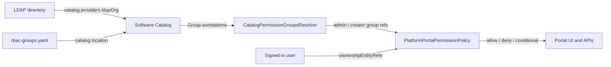

# Platform Portal Permissions

This document describes how access control works in the Platform Portal. Use it as the reference when adding teams, changing who can create components, or debugging permission issues.

## Overview

The portal uses Backstage's **open-source permission framework**. Access is **not** managed by Spotify's paid RBAC plugin and does **not** require a license key.

There are two layers:

1. **Who belongs to which group** — LDAP sync writes User and Group membership into the catalog.
2. **What each group is allowed to do** — Group entities carry a catalog annotation that the backend permission policy reads at runtime.

The single file you edit for role assignments is [`catalog/org/rbac-groups.yaml`](../catalog/org/rbac-groups.yaml).

## How it works



On backend startup (and every minute after that):

1. The backend loads all `Group` entities from the catalog.
2. Groups with the annotation `platform-portal.io/permission-roles` are classified as **admin** and/or **creator**.
3. When a user performs an action, the permission policy checks whether the user is a member of those groups (via `ownershipEntityRefs` from the auth token).
4. The policy returns allow, deny, or a conditional decision (for example, entity owner checks).

No UI is provided to edit roles. Changes are made in catalog YAML (or on LDAP-synced groups with the same annotation) and picked up within about one minute.

## Key files

| File | Required | Purpose |
|------|----------|---------|
| [`catalog/org/rbac-groups.yaml`](../catalog/org/rbac-groups.yaml) | **Yes** | Defines groups and their permission roles via annotations |
| [`packages/backend/src/extensions/permissionsPolicyExtension.ts`](../packages/backend/src/extensions/permissionsPolicyExtension.ts) | Yes (code) | Permission rules (read, create, owner-only update/delete) |
| [`packages/backend/src/extensions/catalogPermissionGroupsResolver.ts`](../packages/backend/src/extensions/catalogPermissionGroupsResolver.ts) | Yes (code) | Loads group roles from the catalog |
| [`app-config.yaml`](../app-config.yaml) | Yes | `permission.enabled: true` and catalog location for `rbac-groups.yaml` |
| [`rbac/platform-portal-policy.yaml`](../rbac/platform-portal-policy.yaml) | **No** | Legacy Spotify RBAC reference only; not loaded by the app |

## Group roles annotation

Every group that participates in permissions must have this annotation:

```yaml
metadata:
  annotations:
    platform-portal.io/permission-roles: admin,creator
```

| Annotation value | Meaning |
|------------------|---------|
| `admin` | Full access to all permissions |
| `creator` | Can use **Create** and **Register component** (scaffolder + catalog create) |
| `admin,creator` | Both roles (typical for the platform team) |

Values are comma-separated and case-insensitive.

### Current groups

| Group | Entity ref | Roles | Effect |
|-------|------------|-------|--------|
| Platform | `group:default/platform` | `admin,creator` | Full access; can create components |
| DevOps | `group:default/devops` | `creator` | Can create components only |

## Permission rules

Rules are implemented in `permissionsPolicyExtension.ts`. Group membership only controls **admin** and **creator** shortcuts; all other behavior is fixed in code.

### Admin groups

Members of any group tagged with the `admin` role receive **allow** for every permission check.

### Everyone (default catalog access)

| Action | Decision |
|--------|----------|
| Read catalog entities | Allow |
| Read scaffolder template parameters and steps | Allow |
| Update or delete catalog entities | Allow only if the user **owns** the entity |
| Other catalog-entity actions | Owner only |
| Everything else | Deny |

### Creator groups

Members of any group tagged with the `creator` role (who are not already admins) may also:

| Permission | Used for |
|------------|----------|
| `catalog.entity.create` | Register a component |
| `catalog.location.create` | Catalog import locations |
| `catalog.location.analyze` | Catalog import analysis |
| `scaffolder.task.create` | Run a software template |
| `scaffolder.action.execute` | Execute scaffolder actions |
| `scaffolder.task.read` | View scaffolder task status |

## How to add a new team with Create access

1. Add a `Group` to [`catalog/org/rbac-groups.yaml`](../catalog/org/rbac-groups.yaml):

   ```yaml
   ---
   apiVersion: backstage.io/v1alpha1
   kind: Group
   metadata:
     name: sre
     namespace: default
     annotations:
       platform-portal.io/permission-roles: creator
   spec:
     type: team
     profile:
       displayName: SRE Team
     children: []
   ```

2. Create the matching group in LDAP under `ou=groups,dc=company,dc=com` (or your configured LDAP base).

3. Add users to that group in LDAP.

4. Wait for LDAP catalog sync (default: every 1 minute) and for the permission group refresh (every 1 minute).

5. No change to `app-config.yaml` is required.

To grant full admin access, set `platform-portal.io/permission-roles: admin` or `admin,creator`.

## LDAP integration

LDAP is configured in `app-config.yaml` under `catalog.providers.ldapOrg`. It syncs:

- Users from `ou=users,dc=company,dc=com`
- Groups from `ou=groups,dc=company,dc=com`

**Group names in LDAP must match** the `metadata.name` in `rbac-groups.yaml` (for example `platform`, `devops`). The permission check uses entity refs like `group:default/platform`, which come from catalog group membership on the user's auth token.

If a group is created only in LDAP and not in `rbac-groups.yaml`, add the same `platform-portal.io/permission-roles` annotation to that Group entity (via a catalog location file or your LDAP-to-catalog mapping) for it to receive roles.

## Configuration reference

### Enable permissions

```yaml
# app-config.yaml
permission:
  enabled: true
```

### Register group definitions in the catalog

```yaml
# app-config.yaml
catalog:
  locations:
    - type: file
      target: ../../catalog/org/rbac-groups.yaml
```

### Backend modules

Registered in [`packages/backend/src/index.ts`](../packages/backend/src/index.ts):

```ts
backend.add(import('@backstage/plugin-permission-backend'));
backend.add(import('./extensions/permissionsPolicyExtension'));
```

## Troubleshooting

### User cannot see Create or Register actions

- Confirm the user is a member of a group with the `creator` or `admin` role in LDAP.
- Confirm the group exists in the catalog with `platform-portal.io/permission-roles` set.
- Check backend logs for: `Permission groups loaded from catalog: X admin, Y creator`.
- Wait up to one minute after catalog or YAML changes.

### User cannot see catalog entities

- Read access is allowed for everyone by default. If entities are missing, check catalog ingestion and locations, not group roles.

### Changes to rbac-groups.yaml have no effect

- Confirm the file is listed under `catalog.locations` in `app-config.yaml`.
- Restart the backend if the catalog location was added recently.
- Check for catalog processing errors in backend logs.

### Fallback defaults

If no annotated groups are found in the catalog, the backend falls back to:

- Admin: `group:default/platform`
- Creator: `group:default/platform`, `group:default/devops`

A warning is logged when this happens.

## Changing permission logic

To change **which actions** are allowed (not just **which groups**), edit [`permissionsPolicyExtension.ts`](../packages/backend/src/extensions/permissionsPolicyExtension.ts) and redeploy the backend.

To change **which groups** get admin or creator access, edit annotations in [`catalog/org/rbac-groups.yaml`](../catalog/org/rbac-groups.yaml) only.

## Related Backstage documentation

- [Permissions getting started](https://backstage.io/docs/permissions/getting-started)
- [Writing a permission policy](https://backstage.io/docs/permissions/writing-a-policy)
- [Catalog LDAP org provider](https://backstage.io/docs/integrations/ldap/org)
